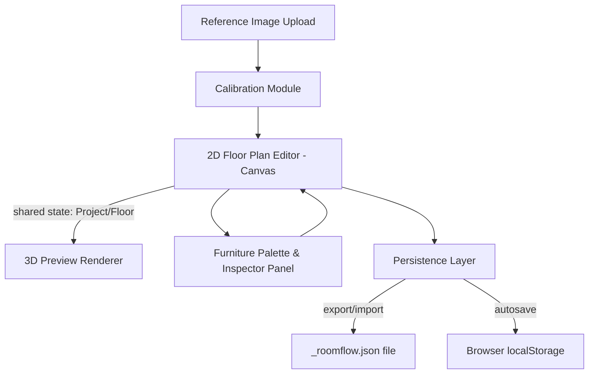

# RoomFlow — Architecture Document

Companion to [prd.md](prd.md) and [spec.md](spec.md).

## 1. High-Level Architecture
Single-page web app, fully client-side for MVP (no backend server required — persistence is file export/import + localStorage). This keeps the MVP simple, free to host, and avoids account/auth complexity per PRD decisions.

## 2. Tech Stack

| Concern | Choice | Rationale |
|---|---|---|
| Language | TypeScript | Type-safe data model shared across 2D/3D/persistence layers (see [spec.md](spec.md) §2). |
| UI framework | React (Vite) | Fast dev loop, huge ecosystem, easy component-based panels/palette/inspector. |
| 2D canvas | Konva.js (`react-konva`) | Retained-mode canvas with built-in drag/transform/hit-testing, avoids hand-rolling shape interaction. |
| 3D rendering | Three.js (`react-three-fiber`) | De facto standard for web 3D; easy declarative scene graph from React state. |
| State management | Zustand | Minimal boilerplate, works well with undo/redo middleware, avoids Redux ceremony for a single-user local app. |
| Undo/redo | `zundo` (Zustand temporal middleware) or custom command stack | Needed for wall/furniture editing per spec §4-5. |
| Styling | Tailwind CSS | Fast iteration for panels/toolbars. |
| Persistence | Browser File System Access API (with `<a download>` fallback) + `localStorage` | No backend needed for MVP. |
| Validation | Zod | Runtime schema validation for imported JSON + input parsing guards. |
| Testing | Vitest + React Testing Library; Playwright for e2e | Standard Vite-ecosystem pairing. |
| Build/hosting | Vite build → static hosting (e.g., Netlify/Vercel/GitHub Pages) | No server-side code required. |

## 3. Module Breakdown

- **`core/model`** — TypeScript types (`Project`, `Floor`, `Room`, `Wall`, `Opening`, `FurnitureInstance`, `FurnitureCatalogItem`) and Zod schemas mirroring [spec.md](spec.md) §2. This is the single source of truth consumed by both 2D and 3D renderers — no separate 3D-specific data model, avoiding sync bugs.
- **`core/units`** — `parseLength`, `formatLength`, mm↔feet/inches↔metric conversion utilities (spec §1).
- **`core/geometry`** — polygon/room area (shoelace formula), SAT overlap detection, snapping math, wall-polyline-to-polygon closure detection (spec §4-5).
- **`state/projectStore`** — Zustand store holding the active `Project`, wrapped with undo/redo middleware; exposes actions (`addWall`, `moveFurniture`, `calibrateImage`, etc.) rather than raw setters, so all mutation goes through validated, undo-tracked paths.
- **`features/calibration`** — UI + logic for the two-click calibration flow.
- **`features/floorplan-editor`** — Konva-based 2D canvas: reference image layer, grid, wall drawing tool, room detection, furniture layer, selection/transform handles.
- **`features/furniture-palette`** — catalog browser (basic shapes + presets) and "add to canvas" interactions.
- **`features/inspector`** — side panel for precise numeric editing of selected wall/room/furniture (position, rotation, dimensions) — the authoritative precise-input path per spec §5.
- **`features/preview-3d`** — react-three-fiber scene that subscribes to the same `projectStore` and reactively rebuilds meshes from `Floor` data (walls extruded, furniture as boxes/cylinders).
- **`features/persistence`** — export/import to `_roomflow.json`, schema version migrations, debounced localStorage autosave, "resume last session" prompt.
- **`app/`** — top-level layout: toolbar, palette (left), canvas + view-mode tabs (center), inspector (right).

## 4. Data Flow
1. All user actions dispatch store actions on `projectStore`.
2. `projectStore` is the single source of truth (per [spec.md](spec.md) data model); both the 2D canvas and 3D scene are pure reactive views over it — no bidirectional syncing logic, eliminating a whole class of "views out of sync" bugs.
3. Undo/redo operates at the store level (whole-state snapshots or command objects), so it uniformly covers wall, room, and furniture edits.
4. Persistence reads/writes the same `Project` shape directly (it *is* the serialization format), so export is just `JSON.stringify(project)` plus embedding image data URLs.

## 5. Why Client-Only (No Backend) for MVP
- PRD explicitly scopes out accounts/cloud sync for MVP (file export/import + localStorage chosen instead).
- Removes auth, database, and hosting-cost concerns entirely for MVP; can be added later (see §7) without changing the core data model, since `Project` JSON is already a portable, backend-agnostic format.

## 6. Key Technical Risks & Mitigations
- **Large embedded images bloat JSON/localStorage.** Mitigation: downscale reference images to a reasonable max resolution (e.g., 2000px longest side) on upload before storing; warn if localStorage quota (~5-10MB) is approached.
- **Canvas performance with many furniture/wall objects.** Mitigation: Konva's layer caching; keep reference image on its own non-redrawing layer.
- **3D reactive rebuild cost on every drag frame.** Mitigation: throttle 3D scene updates during active drag (e.g., update on drag-end, or via `requestAnimationFrame` batching) rather than per-pixel.
- **Undo/redo complexity across nested arrays (walls/furniture).** Mitigation: use immutable update patterns (Immer, already common alongside Zustand) so snapshotting is cheap and correct.

## 7. Future Architecture Extensions (Post-MVP)
- Add a thin backend (e.g., Firebase/Supabase) for accounts + cloud project storage — the existing `Project` JSON shape becomes the document stored per-user, minimizing migration effort (aligns with the [firebase-firestore-standard] and [firebase-auth-basics] patterns already available as skills if this project later adopts Firebase).
- OCR phase: introduce a `features/ocr` module (e.g., Tesseract.js client-side, or a server-side call if accuracy requires a hosted model) that proposes room dimension text extracted from the reference image, feeding into the calibration/room-naming flow as suggestions, not automatic overwrites.
- CV wall-detection phase: likely needs a server-side or WASM-based CV pipeline (e.g., OpenCV.js) — flagged as the largest architectural addition, deliberately deferred past MVP per PRD.
