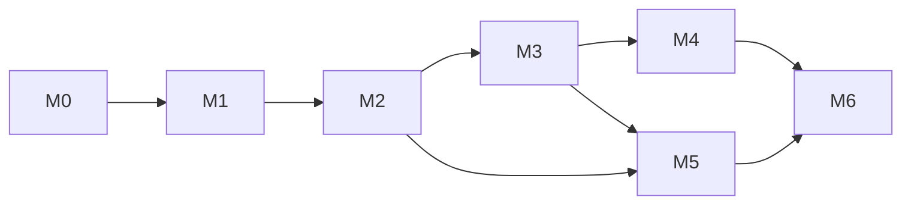

# RoomFlow — Delivery Plan

Companion to [prd.md](prd.md), [spec.md](spec.md), [architect.md](architect.md), [design.md](design.md). See [tasks.md](tasks.md) for the granular task breakdown.

## 1. Guiding Scope Decisions (from stakeholder Q&A)
- Platform: web app (browser), desktop-first.
- Blueprint input: manual calibration (2-point click + known distance) and manual wall tracing for MVP; OCR and CV auto-detection deferred to later phases.
- Views: both 2D (primary editor) and 3D (read-only preview) from the start.
- Furniture: basic parametric shapes + a small preset library, all with user-editable dimensions.
- Persistence: no accounts; export/import to a JSON project file, plus localStorage autosave.
- Multi-room: full apartment (multiple rooms per project) supported in MVP.
- Units: feet/inches default with metric toggle.
- Stack: React + TypeScript + Vite, Konva for 2D, react-three-fiber/Three.js for 3D, Zustand for state (see [architect.md](architect.md) §2).

## 2. Milestones

### M0 — Project Setup
Scaffold the Vite/React/TypeScript app, install core dependencies, set up linting/testing, establish the `core/model` types and Zod schemas as the single source of truth.

### M1 — Calibration & Reference Image
Upload a blueprint image, position it, and calibrate scale via the 2-point/known-distance flow. Deliverable: an image on canvas with a correct, editable `pixelsPerMm`.

### M2 — 2D Floor Plan Authoring (Walls, Openings, Rooms)
Wall drawing tool with snapping, door/window openings, room closure detection + naming + area calculation, undo/redo. Deliverable: a user can trace the sample blueprint into a multi-room 2D floor plan.

### M3 — Furniture Palette & Placement
Catalog data (basic shapes + presets), palette UI, drag/click-to-place, selection + transform (move/rotate/resize) via canvas and inspector panel, overlap highlighting. Deliverable: user can furnish traced rooms with correctly dimensioned pieces.

### M4 — 3D Preview
react-three-fiber scene reactively rendering the same `Project` data (extruded walls + boxed/cylindrical furniture), orbit controls. Deliverable: switching to "3D" tab always matches current 2D state.

### M5 — Persistence
JSON export/import with schema versioning + validation, debounced localStorage autosave, "resume last session" prompt. Deliverable: full round-trip save/reload without data loss.

### M6 — Polish & MVP Hardening
Empty/edge states, accessibility pass, performance check (large plans), responsive layout tweaks, sample project (using the actual Room2105 blueprint) as a demo/onboarding fixture.

## 3. Milestone Dependencies

## 4. Definition of Done (MVP)
- A user can: upload the sample blueprint → calibrate it → trace all rooms (living/dining, kitchen, bath, closets) → add and precisely dimension at least the preset furniture types listed in the PRD → view the result in 3D → export and re-import the project with no data loss.
- All numeric transforms have both a direct-manipulation (drag) and exact-input (typed) path (per [design.md](design.md) principle #1).
- No backend/account dependency; app runs fully static.

## 5. Explicitly Deferred (tracked, not scheduled)
- OCR-based dimension text extraction (PRD Phase 2).
- CV-based automatic wall detection (PRD Phase 3).
- Editable 3D view, larger furniture catalog with imagery/materials, hard collision constraints, cloud accounts/sharing, mobile app.

## 6. Assumptions & Constraints Carried Into Implementation
- No server component in MVP — all listed milestones must be achievable as static-hosted client code (per [architect.md](architect.md) §5).
- Reference images are embedded as base64 in the exported JSON; large images are downscaled on upload to bound file size (per [architect.md](architect.md) §6).
- Overlap detection is advisory (visual warning), never a hard block on placement (per [spec.md](spec.md) §5).
